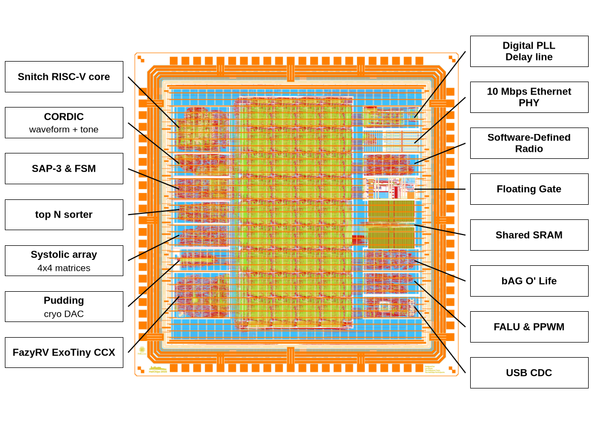

# HeiChips 2026 Tapeout [WIP!]

This repository contains the chip for the [HeiChips Summer School 2026](https://heichips.github.io/) targeting SG13CMOS5L from IHP. It includes several designs created during the Hackathon all connected to a common eFPGA fabric in the center.
Thanks to FABulous, the user bitstream for the FPGA can be generated using the Yosys and nextpnr toolchain.

The chip is designed with open source EDA tools and the [IHP Open Source PDK](https://github.com/IHP-GmbH/IHP-Open-PDK).

<p align="center">
  <a href="">
    
  </a>
</p>

## Feature Overview

The chip includes several user submitted designs from the HeiChips 2026 Hackathon. In the center of the chip is an eFPGA which allows the user projects to connect to each other, utilize the SRAM, or connect to the external I/Os.

- [FABulous](https://github.com/FPGA-Research/FABulous) eFPGA
  - 32x I/Os
  - 288x LUT4 + FF
    - w. carry chain
  - 1x SRAM
    - 4 KiB memory: 32 bit wide, 10 bit deep (1024 entries)
    - individual bit-enable
  - 4x global buffers
  - 1x system reset

The following user projects are included:



| Project       | Size          | Location      | Description   | Link |
|---------------|---------------|---------------|---------------|------|
|               |               |               |               |      |
|               |               |               |               |      |
|               |               |               |               |      |
|               |               |               |               |      |
|               |               |               |               |      |
|               |               |               |               |      |
|               |               |               |               |      |
|               |               |               |               |      |

## Configuration of the FPGA Fabric

The eFPGA fabric can be configured using the SPI peripheral or the SPI controller, depending on the value of `fpga_mode`.

| fpga_mode | description |
|---|---|
| 0 | Active SPI mode. |
| 1 | Passive SPI mode. |

If active SPI mode is selected and fpga_rst_n is deasserted, the configuration logic will fetch the bitstream from slot 0 (address 0) of the external SPI flash. Using fpga_config_slot[3:0] and fpga_config_trigger (which is only possible when the configuration logic is not busy), it is possible to initiate reconfiguration from a different slot.
The offset of the slots is 0x800 words (0x2000 bytes). The controller uses the first 0x5A6 words (0x1698 bytes) of a slot as the bitstream.

If passive SPI mode is selected, the bitstream can be supplied via an external SPI controller.

## Specification

The IO voltage (IOVDD) should be 3.3V.
The core voltage (VDD) should be 1.2V.

The top level, including the configuration logic, was implemented for the following corners at 80MHz and is free of setup and hold violations.

- nom_typ_1p20V_25C
- nom_fast_1p32V_m40C
- nom_slow_1p08V_125C
- nom_typ_1p50V_25C
- nom_fast_1p65V_m40C
- nom_slow_1p35V_125C

Using a core voltage higher than 1.65V (while remaining within the safe operating area) may still work, but could lead to hold violations in the configuration logic. If that happens, you can try increasing the voltage after configuration of the FPGA is complete.

## Pinout

<p align="center">
  <a href="img/bonding_diagram.png">
    
  </a>
</p>

| Pin name                | Description                   |
|-------------------------|-------------------------------|
| fpga_clk                | The clock for the FPGA configuration logic. |
| fpga_rst_n              | The reset for the FPGA configuration logic (active low) |
| fpga_mode               | Set configuration mode. 0 = active, 1 = passive. |
| fpga_config_busy        | High while the FPGA is under configuration. |
| fpga_config_configured  | High after the FPGA has been configured. |
| fpga_sclk               | SPI: source clock             |
| fpga_cs_n               | SPI: chip select (active low) |
| fpga_mosi               | SPI controller out, peripheral in |
| fpga_miso               | SPI: controller in, peripheral out |
| fpga_config_trigger     | If high, trigger a reconfiguration in active mode from one of 16 slots of the SPI flash. |
| fpga_config_slot[0]     | Set bit 0 for the FPGA configuration slot. |
| fpga_config_slot[1]     | Set bit 1 for the FPGA configuration slot. |
| fpga_config_slot[2]     | Set bit 2 for the FPGA configuration slot. |
| fpga_config_slot[3]     | Set bit 3 for the FPGA configuration slot. |
| ...                     | Pin of the ... project. |
| ...                     | Pin of the ... project. |
| ...                     | Pin of the ... project. |
| ...                     | Pin of the ... project. |
| ...                     | Pin of the ... project. |
| ...                     | Pin of the ... project. |
| ...                     | Pin of the ... project. |
| ...                     | Pin of the ... project. |
| ...                     | Pin of the ... project. |
| ...                     | Pin of the ... project. |
| ...                     | Pin of the ... project. |
| ...                     | Pin of the ... project. |
| ...                     | Pin of the ... project. |
| ...                     | Pin of the ... project. |
| ...                     | Pin of the ... project. |
| ...                     | Pin of the ... project. |
| ...                     | Pin of the ... project. |
| ...                     | Pin of the ... project. |
| fpga_io[0]              | I/O pin which can be controlled by the FPGA user project. |
| fpga_io[1]              | I/O pin which can be controlled by the FPGA user project. |
| fpga_io[2]              | I/O pin which can be controlled by the FPGA user project. |
| fpga_io[3]              | I/O pin which can be controlled by the FPGA user project. |
| fpga_io[4]              | I/O pin which can be controlled by the FPGA user project. |
| fpga_io[5]              | I/O pin which can be controlled by the FPGA user project. |
| fpga_io[6]              | I/O pin which can be controlled by the FPGA user project. |
| fpga_io[7]              | I/O pin which can be controlled by the FPGA user project. |
| fpga_io[8]              | I/O pin which can be controlled by the FPGA user project. |
| fpga_io[9]              | I/O pin which can be controlled by the FPGA user project. |
| fpga_io[10]             | I/O pin which can be controlled by the FPGA user project. |
| fpga_io[11]             | I/O pin which can be controlled by the FPGA user project. |
| fpga_io[12]             | I/O pin which can be controlled by the FPGA user project. |
| fpga_io[13]             | I/O pin which can be controlled by the FPGA user project. |
| fpga_io[14]             | I/O pin which can be controlled by the FPGA user project. |
| fpga_io[15]             | I/O pin which can be controlled by the FPGA user project. |
| fpga_io[16]             | I/O pin which can be controlled by the FPGA user project. |
| fpga_io[17]             | I/O pin which can be controlled by the FPGA user project. |
| fpga_io[18]             | I/O pin which can be controlled by the FPGA user project. |
| fpga_io[19]             | I/O pin which can be controlled by the FPGA user project. |
| fpga_io[20]             | I/O pin which can be controlled by the FPGA user project. |
| fpga_io[21]             | I/O pin which can be controlled by the FPGA user project. |
| fpga_io[22]             | I/O pin which can be controlled by the FPGA user project. |
| fpga_io[23]             | I/O pin which can be controlled by the FPGA user project. |
| fpga_io[24]             | I/O pin which can be controlled by the FPGA user project. |
| fpga_io[25]             | I/O pin which can be controlled by the FPGA user project. |
| fpga_io[26]             | I/O pin which can be controlled by the FPGA user project. |
| fpga_io[27]             | I/O pin which can be controlled by the FPGA user project. |
| fpga_io[28]             | I/O pin which can be controlled by the FPGA user project. |
| fpga_io[29]             | I/O pin which can be controlled by the FPGA user project. |
| fpga_io[30]             | I/O pin which can be controlled by the FPGA user project. |
| fpga_io[31]             | I/O pin which can be controlled by the FPGA user project. |


## Building User Designs for the eFPGA

To build a bitstream of a user design for the eFPGA, see [README.md](ip/fabric/user_designs/README.md) under `ip/fabric/user_design`.

## Building the Chip

### Prerequisites

> [!NOTE]
> Either clone the repo using the following command: 
>```console
>git clone --recurse-submodules git@github.com:FPGA-Research/heichips25-tapeout.git
>```
> or initialize the submodules if you cloned the repo without them:
>
>```console
> git submodule update --init --recursive .
>```

To clone the compatible PDK version, simply run `make clone-pdk`.

For information on installing Nix with the FOSSi Foundation cache, please refer to the LibreLane documentation: https://librelane.readthedocs.io/en/stable/installation/nix_installation/index.html

Afterwards you can enable a Nix shell by running `nix-shell`.

## Stitch the Fabric

As a prerequisite make sure that the tiles for the tile library that you are using have been implemented in `ip/fabulous-tiles`.
If that is the case, you can proceed by enabling a Nix shell with LibreLane in this repository:

```
nix-shell
```

To implement the fabric, run:

```
make classic_fabric_heichips25
```

After the fabric has been implemented you can view it either in OpenROAD or KLayout by appending `-openroad` or `-klayout` to the fabric name.
For example, to view `classic_fabric_heichips25` in OpenROAD, run: `make classic_fabric_heichips25-openroad`.

After the fabric has been generated, run:

```
make copy-fabric
```

### Build The Chip

To build the chip with LibreLane:

```console
make librelane
```

To view the design in OpenROAD:

```console
make librelane-openroad
```

Or to view it in KLayout:

```console
make librelane-klayout
```

To render an image of the chip:

```
make render-image
```

And with this the chip is ready for tapeout. 

## Implement User Designs

Please see the README in `user_designs/` on how to implement a user design for the fabrics.

### Simulate the Fabric

To run all fabric simulations, simply run one of:

```
make sim-fabric             # RTL sim of the fabric
make sim-fabric-emulation   # RTL sim of the fabric, bitstream preloaded
make sim-fabric-gl          # GL sim of the fabric (after implementation)
```

To view the waveform results:

```
make sim-fabric-view
```

### Simulate the Chip

To run all chip top simulations, simply run one of:

```
make sim-top             # RTL sim of chip top
make sim-top-emulation   # RTL sim of chip top, bitstream preloaded
make sim-top-gl          # GL sim of chip top (after implementation)
```

To view the waveform results:

```
make sim-top-view
```

## License

The chip is licensed under the Apache 2.0 license. This license may *not* apply to the remainder of the repository.

## Acknowledgements

The chip was designed by Leo Moser for the HeiChips Summer School 2026.

Thanks to [Heidelberg University](https://www.uni-heidelberg.de/en), [BMFTR](https://www.bmftr.bund.de/) and [Chipdesign Germany](https://www.chipdesign-germany.de/en/) for the finanical support enabling the tapeout of the chip.
