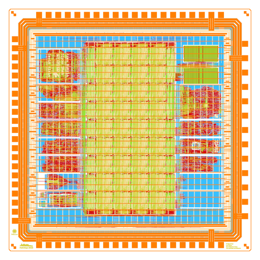
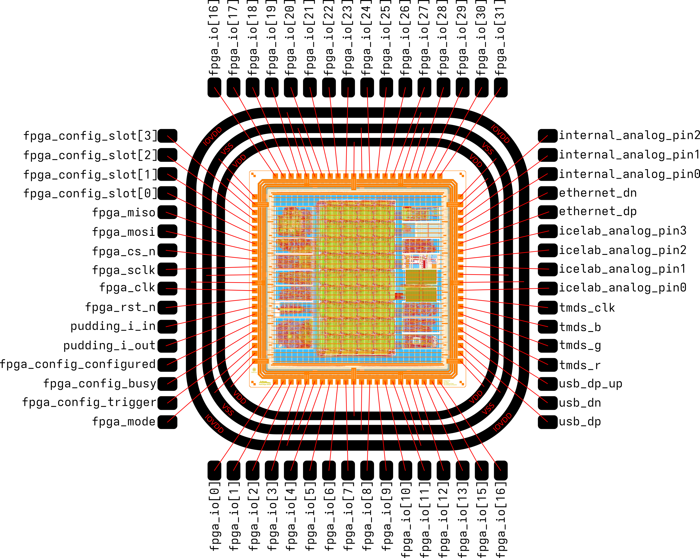

# HeiChips 2025 Tapeout


This repository contains the chip for the [HeiChips Summer School 2025](https://heichips.github.io/) targeting SG13CMOS from IHP. It includes several designs created during the Hackathon all connected to a common eFPGA fabric in the center.
Thanks to FABulous, the user bitstream for the FPGA can be generated using the Yosys and nextpnr toolchain.

The chip is designed with open source EDA tools and the [IHP Open Source PDK](https://github.com/IHP-GmbH/IHP-Open-PDK).

<p align="center">
  <a href="img/heichips25_top_white.png">
    
  </a>
</p>

## Feature Overview

The chip includes several user submitted designs from the HeiChips 2025 Hackathon. In the center of the chip is an eFPGA which allows the user projects to connect to each other, utilize the SRAM, or connect to the external I/Os.

- [FABulous](https://github.com/FPGA-Research/FABulous) eFPGA
  - 32x I/Os
  - 288x LUT4 + FF
    - w. carry chain
  - 1x SRAM
    - 4 KiB memory: 32 bit wide, 10 bit deep (1024 entries)
    - individual bit-enable
  - 4x global buffers
  - 1x system reset

The following user projects are included:

| Project | Size | Location | Description | Link |
|---------------|---------------|---------------|---------------|------|
| heichips25_snitch_wrapper | Large | X0Y2          | Snitch RISC‑V (RV32) integer core implemented with LibreLane on IHP SG13G2 (130 nm). | [Link](https://github.com/HeiChips/heichips_25_snitch_core) |
| heichips25_CORDIC | Small | X0Y3          | Waveform + Tone Generation using CORDIC Algorithm. | [Link](https://github.com/HeiChips/heichips25_CORDIC) |
| heichips25_tiny_wrapper2 | Small | X0Y4          | SAP-3 (Simple-As-Possible Computer). </br> FSM: A programmable state machine controller for the Heichips25 tapeout. It can be programmed to implement a wide variety of state machine based designs, such as: Serializer/Deserializer, Pulse Width Modulation (PWM), UART, ... | [Link](https://github.com/HeiChips/heichips25-tiny-wrapper2) |
| heichips25_top_sorter | Small | X0Y5          | A top N sorter (either sorting or finding top N elements) of 28 8-bit numbers at 143 MHz. | [Link](https://github.com/HeiChips/heiChips2025_sap3_and_sorter) |
| heichips25_systolicArrayTop | Small | X0Y6          | Computes the product of two 4x4 matrices. Each input matrix element is a 4-bit unsigned integer. | [Link](https://github.com/HeiChips/heichips25_systolicArray4x4) |
| heichips25_pudding | Small | X0Y7          | DAC for Digital Icy Nano-Ampere-current Generation  | [Link](https://github.com/HeiChips/heichips25-pudding) |
| heichips25_fazyrv_exotiny | Large | X0Y9          | FazyRV ExoTiny CCX implements an minimal-area SoC with custom instruction interface based on the FazyRV RISC-V core. | [Link](https://github.com/HeiChips/heichips25-fazyrv-exotiny) |
| heichips25_internal | Small | X5Y1          | 1. A multimode digital PLL with range from 95MHz to 213MHz input clk multiply up to 5 bits and output clk div up to 5 bits. We have 26 Phase shifts from 0deg to 360deg and 3 output clocks that are phase related to each other. Optionally use a DCO mode to have a free running oscillator that bypasses the controller logic. Output clocks can be XORt with each other to be able to change the duty cycle and at max double frequency. Functionallity confirmed with spice, sdf gatelevel and beh. simulations. </br> 2. Four custom standard cells 2 to 1 muxes and latches. </br> 3. A clock delay line that can delay an input clock this will result in phase shifts. | [Link](https://github.com/HeiChips/heichips25-internal) |
| heichips25_ethernet | Small | X5Y2          | An experimental 10 Mbps Ethernet over custom LVDS, TX-only PHY with an RMII interface and Manchester encoding. Features an MDIO management interface, loopback and bypass test modes, and a simple open-loop differential driver. | [Link](https://github.com/HeiChips/heichips25-ethernet) |
| heichips25_SDR | Small | X5Y3          | Software-Defined Radio System Hardware Acceleration | [Link](https://github.com/HeiChips/heichips25_SDR) |
| heichips25_ICELab | Small | X5Y4          | This chip features a nearly all-digital programmable analog standard cell test infrastructure designed in the open-source iHP 130nm CMOS process. Occupying an area of approximately .5mm^2, the design is optimized for high-density characterization with a minimal footprint of only four analog I/O lines: one output scanner line, two differential input lines, and one pin for current and voltage measurement. The system leverages floating-gate (FG) transistors as programmable elements, utilizing the thick-insulator devices available in the process to enable non-volatile tuning through electron tunneling and hot-electron injection. </br> To support these programming mechanisms without external high-voltage supplies, the chip integrates on-chip Dickson charge pumps, including a positive pump to reach the 8-9V required for tunneling and negative pumps for injection. The internal architecture consists of an array of analog standard cells, such as a Vector-Matrix Multiplier (VMM), a Winner-Take-All (WTA) block, and a small Arbitrary Waveform Generator (AWG), all of which are controlled via a digital infrastructure. For precise measurement and calibration, the chip includes a 6-bit voltage DAC for gate control and a Ramp ADC for automated drain current characterization, providing a complete platform for rapid verification. | [Link](https://github.com/HeiChips/ASHES-IHP130nm) |
| heichips25_bagel | Small | X5Y7          |  bAG O' Life (bAsic Game Of Life) with HDMI output (125 MHz clock, DDR). | [Link](https://github.com/HeiChips/heichips25_bagel) |
| heichips25_tiny_wrapper | Small | X5Y8          | FALU (Fancy ALU) is a custom-designed Arithmetic Logic Unit implemented in Verilog with a flexible interface and extended functionality beyond standard ALUs. It supports not only the typical arithmetic and logic operations, but also more advanced functions like population count, approximate log, and even a tiny “sort” operation. </br> PPWM: This project aims to create a programmable PWM module. In this context, "programmable" signifies that the module is initialized with a set of instructions. These instructions are then executed by its internal state machine, enabling dynamic PWM behavior. This allows for modifications to the PWM characteristics over time. A practical application of this would be, for instance, creating a pulsing LED effect. | [Link](https://github.com/HeiChips/heichips25-tiny-wrapper) |
| heichips25_usb_cdc | Small | X5Y9          | A USB CDC core taken from https://github.com/ulixxe/usb_cdc. USB_CDC is a Verilog implementation of the Full Speed (12Mbit/s) USB communications device class (or USB CDC class). It implements the Abstract Control Model (ACM) subclass. | [Link](https://github.com/HeiChips/heichips25-usb_cdc) |

## Configuration of the FPGA Fabric

The eFPGA fabric can be configured using the SPI peripheral or the SPI controller, depending on the value of `fpga_mode`.

| fpga_mode | description |
|---|---|
| 0 | Active SPI mode. |
| 1 | Passive SPI mode. |

If active SPI mode is selected and fpga_rst_n is deasserted, the configuration logic will fetch the bitstream from slot 0 (address 0) of the external SPI flash. Using fpga_config_slot[3:0] and fpga_config_trigger (which is only possible when the configuration logic is not busy), it is possible to initiate reconfiguration from a different slot.
The offset of the slots is 0x800 words (0x2000 bytes). The controller uses the first 0x5A6 words (0x1698 bytes) of a slot as the bitstream.

If passive SPI mode is selected, the bitstream can be supplied via an external SPI controller.

## Specification

The IO voltage (IOVDD) should be 3.3V.
The core voltage (VDD) should be 1.2V.

The top level, including the configuration logic, was implemented for the following corners at 80MHz and is free of setup and hold violations.

- nom_typ_1p20V_25C
- nom_fast_1p32V_m40C
- nom_slow_1p08V_125C
- nom_typ_1p50V_25C
- nom_fast_1p65V_m40C
- nom_slow_1p35V_125C

Using a core voltage higher than 1.65V (while remaining within the safe operating area) may still work, but could lead to hold violations in the configuration logic. If that happens, you can try increasing the voltage after configuration of the FPGA is complete.

## Pinout

<p align="center">
  <a href="img/bonding_diagram.png">
    
  </a>
</p>

| Pin name                | Description                   |
|-------------------------|-------------------------------|
| fpga_clk                | The clock for the FPGA configuration logic. |
| fpga_rst_n              | The reset for the FPGA configuration logic (active low) |
| fpga_mode               | Set configuration mode. 0 = active, 1 = passive. |
| fpga_config_busy        | High while the FPGA is under configuration. |
| fpga_config_configured  | High after the FPGA has been configured. |
| fpga_sclk               | SPI: source clock             |
| fpga_cs_n               | SPI: chip select (active low) |
| fpga_mosi               | SPI controller out, peripheral in |
| fpga_miso               | SPI: controller in, peripheral out |
| fpga_config_trigger     | If high, trigger a reconfiguration in active mode from one of 16 slots of the SPI flash. |
| fpga_config_slot[0]     | Set bit 0 for the FPGA configuration slot. |
| fpga_config_slot[1]     | Set bit 1 for the FPGA configuration slot. |
| fpga_config_slot[2]     | Set bit 2 for the FPGA configuration slot. |
| fpga_config_slot[3]     | Set bit 3 for the FPGA configuration slot. |
| usb_dp                  | Pin of the heichips25_usb_cdc project. |
| usb_dn                  | Pin of the heichips25_usb_cdc project. |
| usb_dp_up               | Pin of the heichips25_usb_cdc project. |
| tmds_r                  | Pin of the heichips25_bagel project. |
| tmds_g                  | Pin of the heichips25_bagel project. |
| tmds_b                  | Pin of the heichips25_bagel project. |
| tmds_clk                | Pin of the heichips25_bagel project. |
| icelab_analog_pin0      | Pin of the heichips25_ICELab project. |
| icelab_analog_pin1      | Pin of the heichips25_ICELab project. |
| icelab_analog_pin2      | Pin of the heichips25_ICELab project. |
| icelab_analog_pin3      | Pin of the heichips25_ICELab project. |
| ethernet_dp             | Pin of the heichips25_ethernet project. |
| ethernet_dn             | Pin of the heichips25_ethernet project. |
| pudding_i_out           | Pin of the heichips25_pudding project. |
| pudding_i_in            | Pin of the heichips25_pudding project. |
| internal_analog_pin0    | Pin of the heichips25_internal project. |
| internal_analog_pin1    | Pin of the heichips25_internal project. |
| internal_analog_pin2    | Pin of the heichips25_internal project. |
| fpga_io[0]              | I/O pin which can be controlled by the FPGA user project. |
| fpga_io[1]              | I/O pin which can be controlled by the FPGA user project. |
| fpga_io[2]              | I/O pin which can be controlled by the FPGA user project. |
| fpga_io[3]              | I/O pin which can be controlled by the FPGA user project. |
| fpga_io[4]              | I/O pin which can be controlled by the FPGA user project. |
| fpga_io[5]              | I/O pin which can be controlled by the FPGA user project. |
| fpga_io[6]              | I/O pin which can be controlled by the FPGA user project. |
| fpga_io[7]              | I/O pin which can be controlled by the FPGA user project. |
| fpga_io[8]              | I/O pin which can be controlled by the FPGA user project. |
| fpga_io[9]              | I/O pin which can be controlled by the FPGA user project. |
| fpga_io[10]             | I/O pin which can be controlled by the FPGA user project. |
| fpga_io[11]             | I/O pin which can be controlled by the FPGA user project. |
| fpga_io[12]             | I/O pin which can be controlled by the FPGA user project. |
| fpga_io[13]             | I/O pin which can be controlled by the FPGA user project. |
| fpga_io[14]             | I/O pin which can be controlled by the FPGA user project. |
| fpga_io[15]             | I/O pin which can be controlled by the FPGA user project. |
| fpga_io[16]             | I/O pin which can be controlled by the FPGA user project. |
| fpga_io[17]             | I/O pin which can be controlled by the FPGA user project. |
| fpga_io[18]             | I/O pin which can be controlled by the FPGA user project. |
| fpga_io[19]             | I/O pin which can be controlled by the FPGA user project. |
| fpga_io[20]             | I/O pin which can be controlled by the FPGA user project. |
| fpga_io[21]             | I/O pin which can be controlled by the FPGA user project. |
| fpga_io[22]             | I/O pin which can be controlled by the FPGA user project. |
| fpga_io[23]             | I/O pin which can be controlled by the FPGA user project. |
| fpga_io[24]             | I/O pin which can be controlled by the FPGA user project. |
| fpga_io[25]             | I/O pin which can be controlled by the FPGA user project. |
| fpga_io[26]             | I/O pin which can be controlled by the FPGA user project. |
| fpga_io[27]             | I/O pin which can be controlled by the FPGA user project. |
| fpga_io[28]             | I/O pin which can be controlled by the FPGA user project. |
| fpga_io[29]             | I/O pin which can be controlled by the FPGA user project. |
| fpga_io[30]             | I/O pin which can be controlled by the FPGA user project. |
| fpga_io[31]             | I/O pin which can be controlled by the FPGA user project. |


## Building User Designs for the eFPGA

To build a bitstream of a user design for the eFPGA, see [README.md](ip/fabric/user_designs/README.md) under `ip/fabric/user_design`.

## Building the Chip

### Prerequisites

> [!NOTE]
> Either clone the repo using the following command: 
>```console
>git clone --recurse-submodules git@github.com:FPGA-Research/heichips25-tapeout.git
>```
> or initialize the submodules if you cloned the repo without them:
>
>```console
> git submodule update --init --recursive .
>```

To clone the compatible PDK version, simply run `make clone-pdk`.

For information on installing Nix with the FOSSi Foundation cache, please refer to the LibreLane documentation: https://librelane.readthedocs.io/en/stable/installation/nix_installation/index.html

Afterwards you can enable a Nix shell by running `nix-shell`.

## Stitch the Fabric

As a prerequisite make sure that the tiles for the tile library that you are using have been implemented in `ip/fabulous-tiles`.
If that is the case, you can proceed by enabling a Nix shell with LibreLane in this repository:

```
nix-shell
```

To implement the fabric, run:

```
make classic_fabric_heichips25
```

After the fabric has been implemented you can view it either in OpenROAD or KLayout by appending `-openroad` or `-klayout` to the fabric name.
For example, to view `classic_fabric_heichips25` in OpenROAD, run: `make classic_fabric_heichips25-openroad`.

After the fabric has been generated, run:

```
make copy-fabric
```

### Build The Chip

To build the chip with LibreLane:

```console
make librelane
```

To view the design in OpenROAD:

```console
make librelane-openroad
```

Or to view it in KLayout:

```console
make librelane-klayout
```

To render an image of the chip:

```
make render-image
```

And with this the chip is ready for tapeout. 

## Implement User Designs

Please see the README in `user_designs/` on how to implement a user design for the fabrics.

### Simulate the Fabric

To run all fabric simulations, simply run one of:

```
make sim-fabric             # RTL sim of the fabric
make sim-fabric-emulation   # RTL sim of the fabric, bitstream preloaded
make sim-fabric-gl          # GL sim of the fabric (after implementation)
```

To view the waveform results:

```
make sim-fabric-view
```

### Simulate the Chip

To run all chip top simulations, simply run one of:

```
make sim-top             # RTL sim of chip top
make sim-top-emulation   # RTL sim of chip top, bitstream preloaded
make sim-top-gl          # GL sim of chip top (after implementation)
```

To view the waveform results:

```
make sim-top-view
```

## License

The chip is licensed under the Apache 2.0 license. This license may *not* apply to the remainder of the repository.

## Acknowledgements

The chip was designed by Leo Moser for the HeiChips Summer School 2025.

Thanks to [Heidelberg University](https://www.uni-heidelberg.de/en), [BMFTR](https://www.bmftr.bund.de/) and [Chipdesign Germany](https://www.chipdesign-germany.de/en/) for the finanical support enabling the tapeout of the chip.
